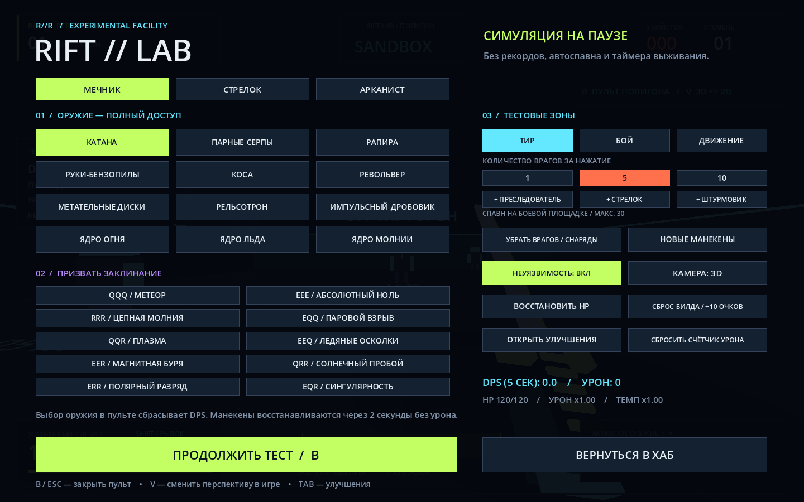

# RIFT // RUSH

**Падай глубже. Двигайся быстрее.**

Играбельный single-player прототип неонового экшена на выживание для **Godot 4.4+**. Все модели, арена, интерфейс, частицы и звуки создаются кодом. Никаких платных ассетов, плагинов или C#.

## 0.3.0 — ретро-графика, мегакомплекс и событие «Перелом»

- **Графика:** оригинальные пиксельные текстуры 64×64 (камень, пол, металл, ткань, плоть, предупредительная разметка) с nearest-фильтрацией, небо, туман, тени от солнца и ламп, ретро-фильтр экрана (**F4** — вкл/выкл, **F3** — эффекты и тени).
- **Модели:** игрок-человек с анимацией конечностей и руками в первом лице; враги различаются силуэтом — человек-мародёр с клинком, робот-стрелок, рогатый монстр; тренировочные манекены-мишени; новые клинки, рукояти револьвера, диски, аптечки, ящики, консоли и трубы.
- **Локации:** залы 50×50 м вместо 26×26, коридоры 12 м, **4 доступных этажа** в каждом из 9 секторов, чередующиеся лестничные рампы, галереи и мост над атриумом. Враги ходят по этажам через граф маршрутов; волны появляются на этаже игрока.
- **Событие «Перелом» (C):** только в 2D-секторах. Появляется предупреждение — за **2 секунды** нажми **C**, камера переключится сверху ↔ сбоку. Боковой режим — сайдскроллер: A/D, прыжок, прицел мышью, ступенчатые платформы. Пропуск — **−15% макс. HP** (игнорирует броню), камера не меняется. После любого исхода — **10 секунд перерыва**. Пауза таймер не расходует. В RIFT LAB есть кнопка теста события.

Проверено в Godot 4.7.2 Web runtime: **92 + 73 прежних и 49 новых проверок** (подъём и спуск по всем этажам, путь врага на верхний этаж, правила C) — все пройдены, плюс 13 проверок целостности. Кадры меню, первого лица, моделей и вида сверху просмотрены в WebGL-рендере. Нативный Windows-Godot и производительность на твоём ПК здесь не измерялись.

## 0.2.1 — проверка целостности и ошибки запуска на Windows

Если редактор пишет **`Safe save failed`** и **`Cannot open file 'res://scenes/main.tscn'`**, сначала прочитай `START_HERE.txt`.

**Проверено:** главная сцена есть и в исходниках, и в опубликованной версии 0.2. Её имя, регистр и путь из `project.godot` совпадают; файл не обрезан. У версии 0.2.1 тот же валидный файл сцены. Переносить сцену в другой каталог или заменять путь на абсолютный не требуется. Эти сообщения сами по себе не доказывают ошибку GDScript: редактор не смог открыть файл, до исполнения игрового кода.

### Как запустить свежую копию

1. Закрой Godot. **Распакуй весь ZIP**, а не открывай `project.godot` прямо внутри архива.
2. Выбери **новую локальную папку**, например `%LOCALAPPDATA%\RiftRush-0.2.1`. Не используй старую папку поверх предыдущей версии, Program Files, сетевой диск или синхронизируемый каталог.
3. Открой внешнюю папку из GitHub-архива. Рядом с `project.godot` должны находиться `scenes/main.tscn`, `scripts/game.gd`, `shaders` и `assets`.
4. Дважды нажми **`CHECK_PROJECT.cmd`**. Он проверит SHA-256 файлов, наличие главной сцены и возможность создать/заменить/удалить временный файл в корне проекта, `scenes` и существующем `.godot`. Python и права администратора не нужны.
5. В менеджере проектов Godot нажми **«Импортировать»**, выбери **новый** `project.godot` по пути, который напечатала проверка, дождись импорта и нажми F5. Старая запись в списке проектов продолжает ссылаться на старую копию.

`MISSING` означает отсутствующий файл; `CHANGED` — отличие от выпуска (включая намеренную правку); `UNREADABLE` — отказ чтения; `WRITE / REPLACE FAILED` — отказ записи/замены. Проверка **не перезаписывает исходники**, не меняет права и не отключает защиту. Обёртка CMD разрешает выполнение только этого процесса PowerShell через `-ExecutionPolicy Bypass`; системную политику выполнения она не меняет.

Если проверка показывает `PASS`, а Godot по-прежнему не сохраняет файлы, проверь **точный путь открытого проекта** и журнал защиты Windows. Проверка, запущенная через PowerShell, не гарантирует, что антивирус разрешает доступ именно `Godot.exe`. `Safe save failed` также может относиться к каталогу настроек редактора, а не проекта. При подтверждённой блокировке используй точечное разрешение доверенному официальному редактору; **не отключай антивирус целиком или Safe Save**. Пришли строки `MISSING`/`CHANGED`/`FAILED` либо `PASS` вместе с новым логом.

### Проверка на других системах / при разработке

```bash
# Python 3.10+, только стандартная библиотека
python3 tools/check_project.py
python3 -m unittest discover -s tests -p 'test_*.py' -v

# Только для автора изменённой версии: обновить контрольные суммы
python3 tools/check_project.py --generate
```

`integrity.json` — перечень SHA-256 файлов поставки. Он обнаруживает случайную порчу/неполную распаковку, но не является цифровой подписью. Не обновляй его до диагностики, иначе отличия будут приняты за новую норму. Собственная музыка `breakcore.ogg/mp3` и созданный редактором кэш не входят в контрольные суммы.

Для 0.2.1 повторно пройдены **165 игровых проверок** в Godot 4.7.2 Web runtime, плюс **13 тестов проверки целостности**. Дополнительно проверяются ZIP CRC, контрольные суммы и ссылки на ресурсы после распаковки готового архива. Windows-редактор и PowerShell на Windows в этой Linux-среде не запускались: локальные ACL, защиту и папку настроек твоего редактора здесь проверить нельзя.

## Обновление 0.2 — Weapons & Lab

### Оружие теперь движется по-разному

- **Катана:** чередующиеся быстрые рубящие удары; **рапира:** прямой выпад; **серпы:** поочерёдная работа рук; **коса:** тяжёлый широкий взмах.
- **Бензопилы:** постоянная вибрация и движущиеся зубья, усиленные во время атаки.
- **Револьвер:** отдача и поворот барабана; **дробовик:** сильный толчок и ход помпы; **рельсотрон:** собственная отдача и катушки на стволе.
- **Диски:** вращение, бросок и появление следующего диска; **магия:** орбитальные сферы, жест призыва и импульс при применении.
- Подъём оружия при экипировке, покачивание при ходьбе и реакция на движение мыши. Модели стали различимее: гарды, рукоятки, изогнутые лезвия, стволы и механические детали.
- Анимации работают **и от первого лица, и на персонаже в виде сверху**. Замах ближнего боя короткий; урон срабатывает в активной части движения. Смена оружия отменяет незавершённый удар, но не обнуляет боевую перезарядку.
- Попадание на 35 мс останавливает **только анимацию** холодного оружия: игрок и мир продолжают двигаться. Появились цифры урона и разлёт деталей уничтоженного робота. **F3** уменьшает частицы и дополнительное покачивание.

### RIFT LAB — отдельная песочница

В хабе нажми **«RIFT LAB / Тестовый полигон»** под кнопкой забега. Обычная арена на выживание остаётся отдельным режимом.



Три соединённые зоны, без таймера выживания и автоматического спавна:

1. **Тир:** три неподвижных манекена по дорожкам 5 / 12 / 20 м. Встань на линию соответствующей дорожки. Манекены имеют 1000 HP, восстанавливаются через 2 секунды без попаданий или при уничтожении. Они не дают опыт и убийства.
2. **Боевая площадка:** вручную создавай преследователей, стрелков и штурмовиков пачками **1 / 5 / 10**, до **30 живых врагов**. Можно удалить врагов и снаряды, не удаляя манекены.
3. **Движение:** прыжковые платформы разной высоты, настоящая яма, наклонная дорожка и высокая площадка. При падении в яму игрок безопасно возвращается к началу этой зоны. Двойной прыжок можно купить за тестовые очки.

**B** открывает пульт и ставит симуляцию на паузу. В нём доступны:
- все 12 вариантов оружия и все 10 заклинаний;
- выбор класса и телепорт в любую из трёх зон;
- переключение первого лица / вида сверху (**V** также работает во время игры);
- неуязвимость вкл/выкл, лечение, сброс билда и восстановление 10 тестовых очков;
- ручной спавн, очистка врагов, восстановление манекенов;
- сброс счётчика урона и возврат в хаб.

**DPS — сумма реально зарегистрированного урона за последние 5 секунд симуляции, делённая на 5.** Отдельно показаны последний урон и общий урон. Выбор оружия через пульт очищает прежние дружественные снаряды и обнуляет статистику для сравнения; смена колёсиком не сбрасывает её. На полигоне даже мечник может испытать комбинации Q/E/R/F. В панели доступны все оружия, горячая панель по-прежнему ограничена девятью слотами.

По умолчанию неуязвимость включена. Если выключить её и погибнуть, враги очищаются, HP восстанавливаются и открывается пульт. **Полигон никогда не изменяет рекорд и не переносит экипировку, врагов или улучшения в обычный забег.**

## Запуск — меньше минуты

1. Скачай стандартную версию **Godot 4.4 или новее** (не обязательно .NET).
2. В менеджере проектов нажми **Импортировать**, выбери `project.godot` из этой папки.
3. Дождись импорта звука и нажми **F6** для сцены или **F5** для проекта. Главная сцена уже назначена.
4. В хабе выбери класс, одно стартовое оружие и нажми **«Начать забег»** или **Enter**.
5. После падения в шахту начинается отсчёт. Твоя цель — оставаться в живых как можно дольше.

Рекомендуются мышь, клавиатура и наушники. Renderer: **Compatibility / OpenGL 3**, без тяжёлых внешних текстур. Если эффекты мешают — **F3**.

## Куда закинуть брейккор

Положи свой трек **в одну из этих папок/файлов относительно `project.godot`:**

```text
assets/music/breakcore.ogg     ← предпочтительно
assets/music/breakcore.mp3     ← тоже можно
```

Имя должно быть именно `breakcore`, строчными буквами. Достаточно одного файла. Вернись в редактор, дождись автоимпорта и перезапусти игру. Приоритет: **OGG → MP3 → встроенный fallback.wav**.

Музыка запускается вместе с забегом и повторяется после завершения трека. **M** — выключить/включить музыку. Уровень громкости можно поменять в `scripts/sound.gd` (`-12 dB`). Для бесшовного авторского лупа включи `Loop` в настройках импорта Godot; обычный трек и без этого автоматически повторится.

**Уже включён оригинальный синтезированный 200 BPM брейкбит**: дроблёные барабаны, снейр-роллы, бас и минорное арпеджио, 38.4 секунды. Это базовый саундтрек прототипа, не чужая коммерческая запись. Исходный генератор — `tools/make_breakbeat.py`; Python нужен только для изменения музыки, не для игры. Для публикации со своим треком проверь права на его использование.

## Что есть в игре

### Хаб и классы

Видимый 3D-хаб с тремя терминалами и шахтой. Выбор сделан через карточки интерфейса — это не отдельная прогулочная локация. На старте только одно оружие.

| Класс | Оружие | Особенность |
|---|---|---|
| **Мечник** | Катана, парные серпы, рапира, руки-бензопилы, коса | 120 HP; убийства в радиусе 8 м лечат на 2 HP |
| **Стрелок** | Револьвер, метательные диски, рельсотрон, импульсный дробовик | Бег чуть быстрее; бесконечный боезапас без перезарядки |
| **Арканист** | Ядро огня, ядро льда, ядро молнии | Стартовое заклинание + свободная комбинация трёх стихий |

Оружие различается механикой: круговой удар косы, узкий сильный выпад рапиры, непрерывные бензопилы, лечение серпами при попадании, возвращающиеся пробивающие диски, сквозной луч рельсотрона, семь дробин дробовика.

### Одна большая арена

```text
07 ─── 08 ─── 09
│
06 ─── 05 ─── 04
               │
        02 ─── 03
        │
        01  ← падение из хаба
```

Девять соединённых залов, широкие коридоры, повороты, рампы и высоты **−6 / 0 / +6 метров**. Все находятся в одной сцене, без экранов загрузки. Можно пройти весь маршрут и вернуться назад.

- Нечётные сектора — **3D от первого лица**.
- Чётные — **плоский ортографический вид сверху**, с движением WASD по экрану и прицеливанием курсором. Это 2D-стиль управления в том же физическом мире, а не отдельная Sprite2D-игра.
- Переход срабатывает при входе в следующий зал, а не посередине рампы. На переходе даётся короткая неуязвимость.
- В новом секторе: **+1 очко улучшения и +25 HP**. Следуй салатовым стрелкам; справа есть мини-карта.
- Девятый зал — не финиш. Враги продолжают появляться; возвращайся по уровню и выживай.

### Бой и развитие

- Три врага: преследователь, стрелок с заметными снарядами, тяжёлый штурмовик с ударом по площади.
- Со временем растут частота волн, здоровье, скорость и урон врагов. Одновременно не больше 48 противников.
- Убийства дают опыт. Новый уровень — **1 очко прокачки**.
- **TAB** открывает восемь улучшений: здоровье, урон, темп атаки, скорость, двойной прыжок, ударная волна при рывке, броня, вампиризм.
- Каждые **12 убийств** автоматически выдаётся новое оружие. Сначала из своего класса; после 36 убийств возможны межклассовые находки. Максимум 9 слотов. Только арканист может пересобирать стихийные комбинации.
- Зелёные осколки притягиваются вблизи и восстанавливают 14 HP.
- Серия убийств поддерживает комбо; получение урона или 4 секунды без убийств сбрасывают его.
- После смерти — результат, лучшее комбо, личный рекорд и быстрый повтор. В нативной игре рекорд хранится в `user://record.cfg`.
- Атаки, попадания, убийства, шаги, прыжки, приземления, рывки, смена оружия, призыв магии и интерфейс сопровождаются синтезированным звуком. В бою есть искры, трассеры, кольца, вспышка попадания, тряска и изменение FOV при рывке.

## Управление

| Кнопка | Действие |
|---|---|
| **WASD / стрелки** | Движение |
| **Мышь** | Обзор в 3D, прицел в виде сверху |
| **ЛКМ, можно удерживать** | Атака / применение заклинания |
| **Shift** | Рывок; короткая неуязвимость; перезарядка 1.1 с |
| **Space** | Прыжок / второй прыжок после улучшения |
| **Колесо / 1–9** | Сменить оружие |
| **Q / E / R** | Добавить огонь / лёд / молнию (арканист) |
| **F** | Призвать заклинание из последних трёх стихий |
| **Tab** | Улучшения, время останавливается |
| **B** | Пульт полигона, только в RIFT LAB |
| **V** | Первый вид / вид сверху, только в RIFT LAB |
| **F1** | Внутриигровая справка и рецепты |
| **M** | Музыка вкл/выкл |
| **F3** | Снизить количество эффектов, убрать тряску |
| **Esc** | Пауза / продолжить |

Буквенные кнопки привязаны к физическим клавишам — работают и с русской раскладкой.

В браузере после выхода из захвата курсора кликни по игре. Для обычной игры надёжнее запуск через Godot или нативный экспорт.

## Магия: 3 стихии, 10 комбинаций

Собери **три нажатия Q/E/R**, нажми **F**, применяй через **ЛКМ**. Порядок не важен: `QER`, `REQ`, `ERQ` дают одно заклинание. Учитываются последние три нажатия; маны нет, только задержка между атаками.

| Рецепт | Заклинание | Эффект |
|---|---|---|
| QQQ | Метеор | Огненный снаряд со взрывом |
| EEE | Абсолютный ноль | Круговая заморозка-замедление вокруг мага |
| RRR | Цепная молния | До пяти целей, затухание урона по цепи |
| QQE | Паровой взрыв | Большой радиус взрыва снаряда |
| QQR | Плазма | Сильный концентрированный снаряд |
| EEQ | Ледяные осколки | Быстрый снаряд с замедляющим взрывом |
| EER | Магнитная буря | Широкая область урона и замедления вокруг мага |
| RRQ | Солнечный пробой | Дальний пробивающий луч |
| RRE | Полярный разряд | Цепная молния с замедлением |
| QER | Сингулярность | Область урона, стягивающая врагов к магу |

## Структура и доработка

```text
project.godot             настройки проекта
scenes/main.tscn           точка входа
scripts/game.gd            состояние забега, волны, урон, прогресс
scripts/world.gd           геометрия хаба, залов и рамп
scripts/player.gd          управление, рывок, оружие, магия
scripts/weapon_rig.gd      модели и процедурные анимации оружия
scripts/lab.gd             три тестовые зоны и логика песочницы
scripts/arsenal.gd         каталог классов, оружия и заклинаний
scripts/enemy.gd           три типа врагов
scripts/projectile.gd      снаряды и возвращающиеся диски
scripts/hud.gd             интерфейс, меню, мини-карта
scripts/fx.gd              частицы и трассеры с лимитом
scripts/sound.gd           синтез SFX и загрузка музыки
shaders/grid.gdshader      мировая сетка пола
assets/music/             музыка
tests/smoke.gd            интеграционные проверки забега
tests/lab_smoke.gd        проверки оружия, анимаций и полигона
```

Изменить карту — `centers` в `game.gd`. Характеристики оружия — `arsenal.gd`. Цвета и плотность декора — `world.gd`. Баланс волн — `spawn_wave()` и `enemy.gd`.

Это законченный **игровой цикл прототипа**, не коммерческий релиз: процедурный геометрический арт, простой AI без NavigationServer, девять фиксированных секторов, без боссов, сетевой игры, контроллера и сохранения текущего забега. Это база для дальнейших моделей, анимаций, новых залов и баланса.

## Экспорт

В `export_presets.cfg` подготовлены **Windows**, **Linux** и **Web**. Установи export templates той же версии, что и твой редактор: **Editor → Manage Export Templates**. Затем **Project → Export**.

```bash
mkdir -p exports/linux exports/web exports/windows
godot --headless --path . --export-release "Linux" exports/linux/rift-rush.x86_64
godot --headless --path . --export-release "Web" exports/web/index.html
```

Web-версия без потоков, работает через HTTP(S), **не** через `file://`. Проверить локально: `python3 -m http.server 8000 --directory exports/web`, затем открыть `http://localhost:8000`. На сервере должен быть доступен WebGL 2. Оригинальные музыкальные файлы пользователя не добавляются в Git автоматически — убери соответствующую строку `.gitignore`, если у тебя есть права и ты хочешь их опубликовать.

## Проверки

```bash
godot --headless --path . --editor --import
godot --headless --path . --script tests/smoke.gd
godot --headless --path . --script tests/lab_smoke.gd
```

Тест поднимает настоящую сцену и физику: падение из хаба, всё оружие, все рецепты, попадание, опыт, покупки, паузу, проход по **всем рампам в обе стороны**, камеры и сброс забега. Отдельный набор проверяет реальный урон каждого анимированного оружия, заморозку/возобновление замаха, DPS, безопасность манекенов, лимит спавна, ручной режим камер, повторный вход и изоляцию песочницы. Итог версии 0.2: **165 проверок пройдены (92 + 73)**. В этой среде выполнены headless-тесты и проверка интерфейса в Chromium через Godot 4.7.2 Web runtime; нативный Godot 4.4 здесь не был доступен для отдельной проверки.

Код и встроенный синтезированный звук — MIT, см. `LICENSE`.
